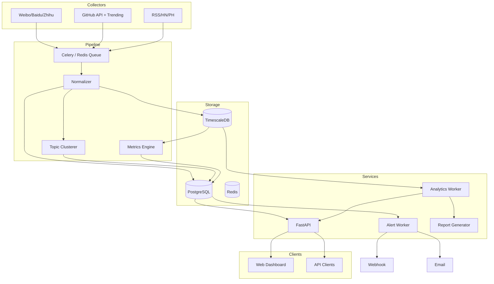

# CatchNews 产品版 — 产品方案

> 版本：v1.0  
> 更新日期：2026-06-14  
> 定位：面向团队与专业用户的「多维度热点数据平台」—— 在个人版可靠聚合基础上，提供深度量化分析与决策支持

---

## 1. 产品概述

### 1.1 一句话描述

CatchNews 产品版在 **个人版全部能力** 之上，构建一套覆盖 **大众娱乐、技术、新闻** 等赛道的热点数据中台，提供 **历史趋势、跨平台对比、Star/排名/搜索量** 等量化分析、自定义监控、告警与报表能力，服务于内容运营、开发者生态观察、行业研究等场景。

### 1.2 与个人版的关系

```
个人版（catchNews Personal）
    │  共享：采集层、数据模型、链接可靠性机制
    ▼
产品版（catchNews Pro）
    + 时序数据库与历史快照
    + 分析引擎（指标计算、趋势、聚类）
    + 用户体系、监控规则、告警
    + Dashboard、API、报表导出
```

**原则**：个人版是「阅读器」，产品版是「分析台 + 轻量 BI」。

### 1.3 核心价值

| 用户诉求 | 产品版能力 |
|----------|------------|
| 不只看「现在什么火」，还要知道「火了多久、涨多快」 | 生命周期曲线、增速、峰值 |
| GitHub 项目值不值得跟 | Star 增长趋势、同类对比、语言分布 |
| 微博热搜和技术热点有没有关联 | 跨赛道共现、关键词关联 |
| 团队需要周报、竞品监控 | 自定义词库、定时报表、Webhook |
| 接入自己的系统 | REST API + Webhook 事件 |

---

## 2. 目标用户与场景

### 2.1 用户画像

| 角色 | 场景 | 关键功能 |
|------|------|----------|
| **内容运营** | 追娱乐热点做选题 | 娱乐榜趋势、排名变化告警、本周汇总报告 |
| **开发者 / TL** | 跟踪技术趋势与新库 | GitHub Star 增速榜、语言趋势、仓库对比 |
| **行业分析师** | 研究话题传播 | 跨平台热度指数、生命周期、共现网络 |
| **独立开发者** | 推广自己的产品 | 监控关键词是否上榜、Product Hunt 表现 |
| **团队管理员** | 统一管理监控规则 | 成员权限、API Key、数据源健康面板 |

### 2.2 使用模式

- **探索型**：打开 Dashboard 看全局趋势（类似个人版增强）
- **监控型**：配置规则，等告警推送
- **分析型**：选时间范围、平台、指标做对比与导出
- **集成型**：通过 API 拉取数据接入 Notion / 飞书 / 自建系统

---

## 3. 数据源规划（扩展）

### 3.1 赛道矩阵

| 赛道 | 平台 | 核心量化字段 | 产品版增强采集 |
|------|------|--------------|----------------|
| **大众娱乐** | 微博热搜 | rank, heat, search_volume | 历史 rank 序列、排名 velocity |
| | 百度热搜 | rank, index | 同上 |
| | 知乎热榜 | rank, heat | 同上 |
| | B站热门 | rank, view_count | 播放增速 |
| | 抖音热榜 | rank, heat | 需第三方/API，P2 |
| **技术向** | GitHub Trending | stars, stars_today, language | **Star 时序、fork 数、issue 活跃度** |
| | GitHub Search/API | stars, forks, watchers | 自定义 repo 监控 |
| | Hacker News | score, rank, comments | 分数增速、评论数 |
| | Product Hunt | upvotes, rank | 日增 upvote |
| | npm/PyPI trends | downloads | P3 扩展 |
| **综合新闻** | RSS 白名单 | publish_time | 关键词命中统计 |
| **搜索趋势** | Google Trends / 百度指数 | index | P2，需 API 或合规数据源 |

### 3.2 数据分层

```
L0 原始快照（Raw Snapshot）     — 每次抓取全量存，不可改
L1 标准化条目（Normalized Item） — 统一 schema，带来源
L2 话题实体（Topic Entity）      — 跨平台聚类后的「同一事件」
L3 分析指标（Metrics）           — 派生：增速、指数、生命周期阶段
```

### 3.3 真实可靠（继承并加强个人版）

- 全部链接走官方域名白名单
- **数据血缘**：每条指标标注 `source_platform`、`capture_method`、`raw_value`
- **API 优先**：GitHub Star/Fork 等走官方 REST/GraphQL，Trending 页作补充
- **对账机制**：GitHub API Star 数 vs 页面展示不一致时，以 API 为准并记 audit log
- **数据源健康度**：各 collector 成功率、延迟、最近成功时间 — Dashboard 可见

---

## 4. 量化分析体系

### 4.1 指标字典

#### 通用指标

| 指标 ID | 名称 | 计算方式 | 用途 |
|---------|------|----------|------|
| `rank` | 当前排名 | 平台原始 | 榜单展示 |
| `rank_delta` | 排名变化 | rank_t - rank_{t-1} | ↑↓ 箭头 |
| `rank_velocity` | 排名变化速率 | Δrank / Δt | 快速上升检测 |
| `presence_days` | 在榜天数 | 7日内出现快照的天数 | 本周汇总 |
| `avg_rank` | 平均排名 | mean(rank) over period | 稳定性 |
| `peak_rank` | 最高排名 | min(rank) over period | 峰值影响力 |
| `heat_score` | 平台热度 | 原始或归一化 | 展示 |
| `cross_platform_score` | 跨平台热度指数 | 见 4.2 | 综合榜 |

#### GitHub 专项指标

| 指标 ID | 名称 | 计算方式 | 用途 |
|---------|------|----------|------|
| `stars_total` | Star 总数 | API `/repos` | 体量 |
| `stars_delta_1d` | 1日 Star 增量 | stars_t - stars_{t-1d} | 短期爆发 |
| `stars_delta_7d` | 7日 Star 增量 | stars_t - stars_{t-7d} | 本周最值得关注 |
| `stars_growth_rate` | Star 增速 | stars_delta / stars_total | 相对增长 |
| `stars_velocity` | Star 增速变化 | Δ(stars_delta) / Δt | 加速上涨 |
| `forks_total` | Fork 数 | API | 活跃度辅助 |
| `trending_language_share` | 语言占比 | 按 language 聚合 Trending | 技术趋势 |

#### 娱乐/新闻专项指标

| 指标 ID | 名称 | 计算方式 | 用途 |
|---------|------|----------|------|
| `search_index` | 搜索指数 | 百度等平台原始 | 搜索量代理 |
| `heat_delta_1h` | 1小时热度变化 | heat_t - heat_{t-1h} | 突发检测 |
| `topic_lifecycle_stage` | 生命周期阶段 | 规则/模型，见 4.3 | 选题时机 |

### 4.2 跨平台热度指数（示例公式）

```
CrossScore(topic, t) =
  Σ_platform [ w_p × norm(heat_p,t) × decay(t - first_seen) ]

其中：
- w_p：平台权重（可配置，默认：微博 0.3, GitHub 0.25, 百度 0.2, 知乎 0.15, 其他 0.1）
- norm()：Min-Max 或 Z-score 归一化到 [0, 100]
- decay：指数衰减，半衰期默认 24h（娱乐）/ 72h（技术）
```

### 4.3 生命周期阶段（规则引擎 v1）

| 阶段 | 判定条件（示例） | 标签色 |
|------|------------------|--------|
| 萌芽 | 首次上榜 ≤ 6h，rank_velocity < 0 | 🌱 |
| 上升 | rank_velocity < -3 或 stars_delta_1d > P90 | 📈 |
| 峰值 | rank ≤ 3 且持续 ≥ 2 快照 | 🔥 |
| 衰退 | rank_velocity > 5 或 stars_delta 连续下降 | 📉 |
| 长尾 | 在榜 > 3d 且 rank > 20 | 💤 |

### 4.4 分析模块清单

| 模块 | 描述 | 优先级 |
|------|------|--------|
| **趋势图** | 单条目 rank / Star / 热度 时序折线 | P0 |
| **对比分析** | 多 repo / 多关键词 同图对比 | P0 |
| **增速榜** | 24h/7d Star 增量、排名上升最快 Top N | P0 |
| **跨平台共现** | 同一关键词在多平台出现的时间线 | P1 |
| **话题聚类** | SimHash / embedding 合并相似标题 | P1 |
| **赛道概览** | 娱乐 vs 技术 热度占比、Top 关键词 | P1 |
| **异常检测** | 热度/Star 突增 Z-score > 2.5 → 告警候选 | P1 |
| **关联网络** | 关键词共现图（可视化） | P2 |
| **预测（可选）** | 基于历史曲线预测 24h 排名区间 | P3 |

---

## 5. 功能需求

### 5.1 功能地图

```
产品版
├── 发现（Discovery）        ← 继承个人版 + 增强筛选
├── 分析（Analytics）
│   ├── 趋势分析
│   ├── 对比分析
│   ├── GitHub 专项
│   └── 跨平台报告
├── 监控（Watch）
│   ├── 关键词监控
│   ├── Repo 监控
│   └── 告警规则
├── 报告（Reports）
│   ├── 日报 / 周报
│   └── 自定义导出
├── 管理（Admin）
│   ├── 数据源健康
│   ├── API Keys
│   └── 成员与权限（团队版）
└── 开放（API）
    ├── REST 查询
    └── Webhook 事件
```

### 5.2 详细功能

#### D1 增强发现页（P0）

- 继承个人版：赛道 Tab、实时/本周、跳转链接
- **新增**：时间范围选择（24h / 7d / 30d / 自定义）
- **新增**：排序：按排名 / Star 增量 / 跨平台指数 / 增速
- **新增**：条目详情侧栏：迷你趋势图 + 生命周期标签 + 历史峰值

#### D2 GitHub 分析中心（P0）

- **Trending 看板**：Daily / Weekly，按语言、 spoken language 筛选
- **Star 增长榜**：1d / 7d / 30d 增量 Top 50，可导出
- **单 Repo 详情页**：
  - Star 时序图（7d/30d/90d）
  - forks、open issues（可选）
  - 与同语言 Top 项目对比
- **语言趋势**：本周 Trending 语言分布饼图 / 环比

#### D3 娱乐热点分析（P0）

- 微博/百度/知乎 排名时序
- 「本周霸榜」「快速上升」「昙花一现」自动标签
- 搜索指数/热度值曲线（有数据时）

#### D4 跨平台分析（P1）

- 输入关键词，展示各平台出现记录与时间线
- 跨平台热度指数曲线
- 共现关键词 Top 10

#### D5 监控与告警（P1）

**监控对象**

- 关键词（标题包含即命中）
- GitHub `owner/repo`
- 平台 + 赛道（如「微博娱乐 Top 10 任意变化」）

**告警条件（规则 builder）**

- 排名进入 Top N
- Star 24h 增量 > X
- 排名 1h 变化 > Y
- 新关键词首次上榜

**通知渠道**

- 邮件
- Webhook（飞书/钉钉/Slack 自定义）
- 站内通知

#### D6 报告（P1）

- **自动周报**：本周各赛道 Top 10、GitHub Star 增长 Top 5、新上榜话题
- 支持 Markdown / PDF / CSV 导出
- 定时发送（cron）

#### D7 Dashboard 自定义（P2）

- 拖拽组件：趋势图、榜单、指标卡
- 保存视图

#### D8 开放 API（P1）

```
GET  /api/v1/hot-items          # 列表，支持 filter
GET  /api/v1/hot-items/{id}     # 详情 + 时序
GET  /api/v1/metrics/github/{owner}/{repo}
GET  /api/v1/reports/weekly
POST /api/v1/watch              # 创建监控
GET  /api/v1/health/sources     # 数据源状态
```

- 认证：API Key（Bearer）
- 限流：按 Key 配额

#### D9 用户与权限（P2，团队版）

- 角色：Owner / Analyst / Viewer
- 监控规则、报表按工作空间隔离

---

## 6. 信息架构与关键页面

### 6.1 导航结构

```
顶部：发现 | 分析 | 监控 | 报告 | 设置
侧边（分析页）：GitHub | 娱乐 | 跨平台 | 自定义
```

### 6.2 GitHub Repo 详情页（线框）

```
┌──────────────────────────────────────────────────────────┐
│  facebook/react          ⭐ 234k   +1.2k(7d)   [监控] [导出] │
│  github.com/facebook/react                                │
├──────────────────────────────────────────────────────────┤
│  [Star 趋势 30d]     ╭──╮                                 │
│                      │  │    ↗ 加速期                      │
│                      ╰──╯                                 │
├──────────────┬──────────────┬──────────────┬─────────────┤
│ 1d +892      │ 7d +4,521    │ 增速 0.19%   │ 阶段: 上升   │
├──────────────┴──────────────┴──────────────┴─────────────┤
│  对比：vuejs/core · sveltejs/svelte · ...                 │
└──────────────────────────────────────────────────────────┘
```

---

## 7. 数据模型（产品版扩展）

### 7.1 核心表

```sql
-- 标准化条目（同个人版，增加 topic_id 外键）
hot_items (
  id, platform, track, external_id, title, url,
  topic_id, created_at, updated_at
)

-- 时序快照（量化分析基础）
hot_snapshots (
  id, item_id, captured_at,
  rank, heat_score, metrics_json  -- GitHub stars, deltas 等
)

-- 话题聚类
topics (
  id, canonical_title, keywords[], tracks[],
  first_seen_at, last_seen_at, lifecycle_stage
)

-- 派生指标（可选，或实时计算）
item_metrics_daily (
  item_id, date,
  stars_delta, avg_rank, peak_rank, cross_platform_score
)

-- 监控规则
watch_rules (
  id, user_id, type, config_json, notify_channels[], enabled
)

-- 告警历史
alerts (
  id, rule_id, item_id, triggered_at, payload_json, read
)
```

### 7.2 存储选型

| 数据类型 | 存储 | 说明 |
|----------|------|------|
| 元数据、用户、规则 | PostgreSQL | 主库 |
| 时序快照 | TimescaleDB 或 PostgreSQL 分区表 | 按 captured_at 分区 |
| 缓存 | Redis | 热榜、API 限流 |
| 报表文件 | 对象存储 / 本地 | PDF、CSV |

---

## 8. 技术架构

### 8.1 系统架构图



### 8.2 采集频率建议

| 数据源 | 频率 | 保留策略 |
|--------|------|----------|
| 微博/百度/知乎 | 15–30 min | 快照保留 90 天，日聚合永久 |
| GitHub Trending | 6 h | 同上 |
| GitHub Star（监控 repo） | 1–6 h | 时序永久（监控对象） |
| HN / RSS | 1 h | 90 天 |

### 8.3 技术栈推荐

| 层级 | 技术 |
|------|------|
| 采集 | Python, httpx, Playwright, PyGithub |
| 队列 | Celery + Redis |
| API | FastAPI |
| 分析 | pandas, TimescaleDB continuous aggregates |
| 聚类 | simhash / sentence-transformers（可选） |
| 前端 | Next.js + ECharts / Recharts |
| 认证 | JWT + API Key |
| 部署 | Docker Compose → K8s（规模化） |

---

## 9. 产品版本规划

### 9.1 版本分层（可选商业化）

| 版本 | 受众 | 能力 |
|------|------|------|
| **Personal** | 个人 | 见《个人版.md》 |
| **Pro** | 专业个人 / 小团队 | 全部分析 + 5 条监控规则 + API 1k/日 |
| **Team** | 团队 | 无限监控 + 成员 + Webhook + API 10k/日 |

### 9.2 里程碑

| 阶段 | 时间 | 目标 |
|------|------|------|
| **P0 基础** | 第 1–2 月 | 个人版能力 + 快照存储 + GitHub Star 趋势图 |
| **P1 分析** | 第 3–4 月 | 增速榜、对比、生命周期、娱乐榜时序 |
| **P2 监控** | 第 5 月 | 监控规则、告警、Webhook |
| **P3 平台化** | 第 6 月+ | API、周报、跨平台指数、团队权限 |

### 9.3 各阶段验收标准

**P0**

- [ ] 任意 hot item 可查看 7 天 rank/Star 折线图
- [ ] GitHub 7d Star 增长榜准确（与 API 对账误差 < 1%）
- [ ] 数据源健康面板可用

**P1**

- [ ] 生命周期标签准确率人工抽检 > 80%
- [ ] 跨平台关键词搜索返回多平台时间线
- [ ] 周报 PDF 自动生成

**P2**

- [ ] 告警延迟 < 5 min（从满足条件到通知）
- [ ] API 文档 + 3 个示例集成（curl / Python / Webhook）

---

## 10. 非功能需求

| 类别 | Pro 目标 | Team 目标 |
|------|----------|-----------|
| API P99 延迟 | < 500ms | < 300ms |
| 数据延迟 | 娱乐榜 < 30 min | 同左 |
| 可用性 | 99.5% | 99.9% |
| 快照写入 | 不丢（at-least-once + 幂等） | 同左 |
| 安全 | API Key 轮换、HTTPS、审计日志 | + SSO（P3） |
| 合规 | 仅公开榜单数据；用户监控词不对外共享 | + 数据保留策略可配置 |

---

## 11. 成功指标（North Star）

| 指标 | 定义 | 目标（上线 3 月） |
|------|------|-------------------|
| **WAU** | 周活跃分析用户 | 视推广而定 |
| **Insight Actions** | 查看趋势 / 导出 / 创建监控 次数 | ≥ 3 次/用户/周 |
| **Alert CTR** | 告警点击跳转率 | > 40% |
| **Data Freshness** | 用户感知数据新鲜度评分 | > 4/5 |
| **API Adoption** | 活跃 API Key 数 | Pro 用户 30%+ 启用 |

---

## 12. 风险与依赖

| 风险 | 等级 | 缓解 |
|------|------|------|
| GitHub API rate limit | 高 | Token 池、缓存、降低非监控 repo 频率 |
| 国内平台反爬 | 高 | 多源冗余、第三方数据采购、清晰降级 UI |
| 话题聚类准确率 | 中 | v1 规则 + 人工合并；v2 模型 |
| 存储成本（快照量大） | 中 | 降采样、日聚合、TTL 策略 |
| 版权与 ToS | 中 | 仅元数据；不存全文；Legal review |

---

## 13. 附录

### 附录 A：个人版 → 产品版迁移路径

1. 复用个人版 collector 与 normalizer 代码
2. 增加 `hot_snapshots` 写入（每次抓取）
3. 上线 Analytics API 与趋势图 frontend
4. 逐步开放监控、告警、API

### 附录 B：API 响应示例

```json
GET /api/v1/hot-items/{id}?include=timeseries&period=7d

{
  "id": "github:facebook/react",
  "platform": "github",
  "track": "tech",
  "title": "facebook/react",
  "url": "https://github.com/facebook/react",
  "metrics": {
    "stars_total": 234000,
    "stars_delta_1d": 892,
    "stars_delta_7d": 4521,
    "stars_growth_rate": 0.00193,
    "lifecycle_stage": "rising"
  },
  "timeseries": [
    { "captured_at": "2026-06-14T08:00:00Z", "stars_total": 233108, "rank": 1 },
    ...
  ]
}
```

### 附录 C：监控规则配置示例

```json
{
  "type": "github_repo",
  "target": "vercel/next.js",
  "conditions": [
    { "metric": "stars_delta_24h", "op": "gt", "value": 500 }
  ],
  "notify": ["webhook:https://hooks.example.com/alert"]
}
```

### 附录 D：竞品参考（定位差异）

| 产品 | 差异 |
|------|------|
| GitHub Trending 官网 | 我们：历史 Star 增速、监控、跨平台 |
| 今日热榜类 App | 我们：技术向深度 + 量化分析 + API |
| 新榜/蝉妈妈 | 我们：轻量、开发者友好、开源可自建 |

---

## 14. 开放问题

1. 产品版首版是否 **只做 Pro 单 tier**，还是同步规划 Team？
2. GitHub 监控 repo 数量上限（影响 API 配额设计）？
3. 是否需要 **内置 LLM 摘要**（「本周技术热点一句话」）— P1 还是 P2？
4. 部署模式：**SaaS 云服务** vs **Self-hosted 企业版** 优先级？
5. 百度指数 / Google Trends 是否纳入 v1（涉及额外 API 成本）？

---

*文档维护：产品负责人 | 依赖文档：《个人版.md》| 下一步：技术方案评审 → P0  backlog 拆解*
